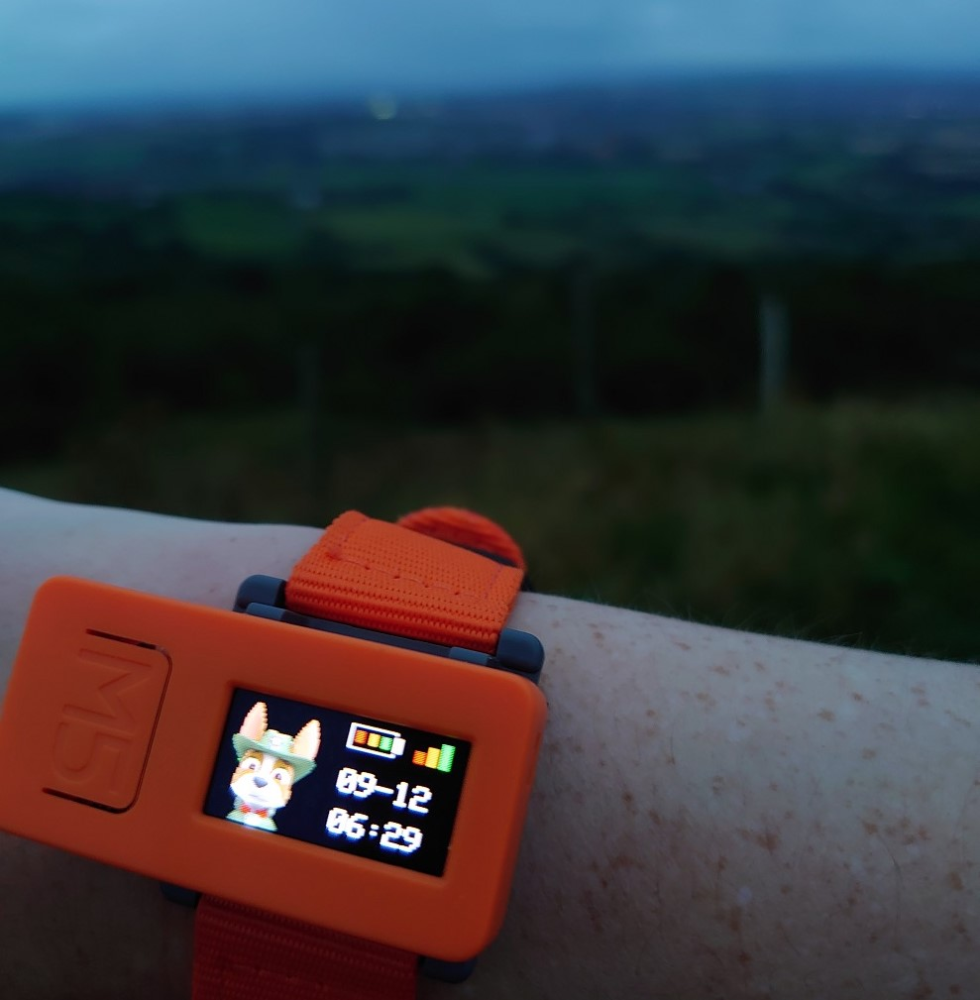

Introduction
============

No job is too big, no pup is too small!

This is a simple Arduino sketch; a peculiar attempt at creating a (non-waterproof) watch that can accompany you on your runs.

Currently, the watch has the following screens:

* Watch
* Stop-watch
* Interval training
* MPU display (accelerometer & gyroscope)

The menu button is used to toggle between the screens, and the activity button is used to stop / start operations on a screen. Action button also toggles between accelerometer and gyroscope readings of the MPU in the MPU display.

The display automatically dims after certain duration of inactivity. The red LED flashes during interval training.

This Arduino code runs on a `M5StickC <https://m5stack.com/products/stick-c>`_ based on the popular ESP32-PICO microcontroller. It it dependent on the `M5StickC GitHub library <https://github.com/m5stack/M5StickC>`_. 

Prerequisites
---------------

* Ensure you follow the `Quick Start for the M5StickC <https://docs.m5stack.com/#/en/arduino/arduino_development>`_ page to have a working Arduino environment, with access to the ESP32 and M5StickC libraries.
* The 80x80 images are stored in the separate :code:`PupTimeBitmaps1.h` file. Instructions on how to change these are provided below. Additional bitmaps are provided, which can be used by changing the number.
* To run, simply open and upload the :code:`PupTime.ino` file using the Arduino IDE.

Hardware
---------------

`M5StickC <https://docs.m5stack.com/#/en/arduino/arduino_development>`_ development boards are equipped with a number of devices and sensors, including:

* ESP32-PICO micro-controller (240MHz dual core, 520KB SRAM, Wi-Fi and Bluetooth support)
* Flash memory 4MB
* 80*160 colour LCD screen (ST7735S)
* 2 buttons
* Red LED
* Motion tracking sensor (MPU6886)
* Infrared transmitter
* Microphone (SPM1423)
* Real-time clock (BM8563)
* Power management (AXP192)
* Built-in rechargeable LiPo battery (95 mAh)

PupTime currently only uses a number of these, namely the buttons, real-time clock, red LED, MPU and the LCD screen.

.. image:: docs/M5StickC.JPG
	:width: 400px

Installation
---------------

* Ensure you have both the :code:`.ino` and :code:`.h` files in the same working directory in the Arduino IDE.
* If the real-time clock of your ESP32 has not been set before, you will want to give it the correct time. Make the following edits in the :code:`.ino` file. The changes need to be reverted back, and code re-uploaded.

Example - Set date and time for the first time
~~~~~~~~~~~~~~~~~~~~~~~~~~~~~~~~~~~~~~~~~~~~~~~~~~~~

.. code-block:: cpp

    firstTimeSetup(); // Uncomment this line. Don't forget to re-comment it out afterwards, so date / time is not reset after every reboot.

    // Change your time values to actual time
    TimeStruct.Hours = 04;
    TimeStruct.Minutes = 41;
    TimeStruct.Seconds = 30;

    // Change your date values to actual date
    DateStruct.WeekDay = 0;
    DateStruct.Month = 8;
    DateStruct.Date = 23;
    DateStruct.Year = 2020;

You should not have to reset the date / time often, as the real-time clock should continue to maintain the current date and time, even if the device remains powered off. In the event that there is time drift, repeat the above process again.

* Upload the :code:`PupTime.ino` file to your M5StickC using the Arduino IDE.

Uploading your own images
=========================

The website `image2cpp <https://javl.github.io/image2cpp/>`_ can be used to convert your own image files into Arduino byte arrays. For best results, we used square PNG files with the background removed.

The following settings were used in `image2cpp <https://javl.github.io/image2cpp/>`_:

* Canvas size: *80x80*
* Background colour: *transparent*
* Scaling: *scale to fit, keeping proportions*
* Code output format: *Arduino code*
* Draw mode: *horizontal - 2 bytes per pixel (565)*

.. note::
	Current code only works with 80x80 images. Half of the 80x160 screen will be used up by the images.

It should now be possible to use your own generated byte arrays in your Arduino code.

.. code-block:: cpp

    const uint16_t myBitmap [] PROGMEM = {
      // Generated Arduino byte array
    }

.. note::
	The code does not currently establish Wi-Fi connectivity. The Wi-Fi symbol is always present on the screen. Further iterations of this code could use the :code:`WiFi.h` and :code:`WiFiClientSecure` libraries to establish connectivity to the wireless network.

Blog Post(s)
=========================

The project is described further in the following `Rosie the Red Robot <https://www.rosietheredrobot.com>`_ blog post:

* Coming soon!

Further Documentation
=========================

* `M5StickC <https://m5stack.com/products/stick-c>`_
* `M5StickC GitHub library <https://github.com/m5stack/M5StickC>`_
* `image2cpp <https://javl.github.io/image2cpp/>`_

Photos
=========================

